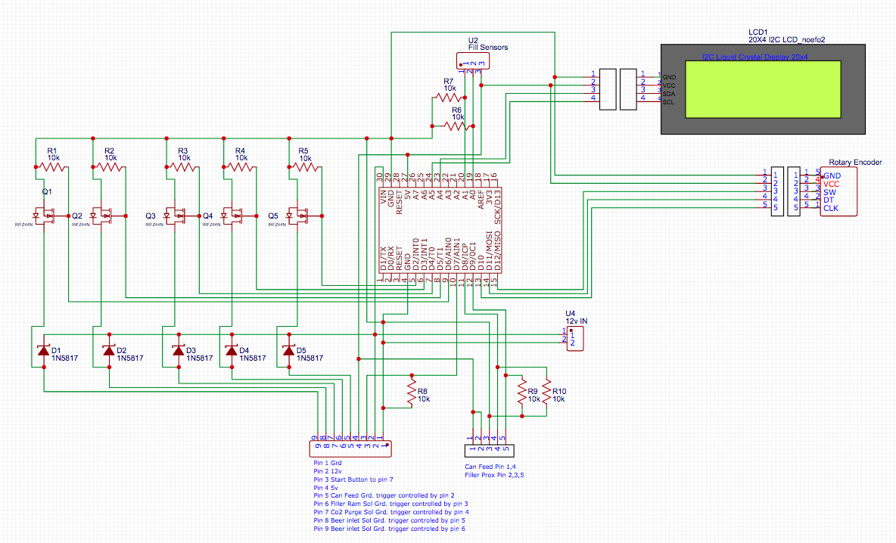

# Open Beer Filler

Open Beer Filler is an Arduino Uno sketch for controlling a beer filling line. The idea was started by Christopher Harrison-Hawkes AKA [HarryBrew69 on YouTube](https://www.youtube.com/channel/UCIIYTzYpd8D7y816diZB0Dw). The sketch works by controlling a beer bottling line via a Arduino Uno and various sensors.

Modified from 3 to 2 can filling system.  Reed switch has been added to the can feed cylinder and proximity switch on filler lift air cylinder. This allows easier setup of the system. Base code used was writen by David Gray (https://github.com/N3MIS15) Allowing the use of I2C LCD screen and rotary encoder. 
Rotary endcoder allows machine timer adjustments via LCD + encoder. Settings to are saved to EEPROM. 

## Configuration
Before uploading the sketch to your Arduino Uno be sure to modify the InputConfig.h and Config.h files to map it to your microcontroller pins. We have mapped the pins to default so if you follow the Schematic below it should work out of the box.

## LCD 
 | PIN
--- | ---
LCD I2C SDA | A4
LCD I2C SCL | A6

### InputConfig.h Definitions
VARIABLE | DEFINITION
--- | ---
CAN_FEED_SOL Pin 2 | The pin controlling the solenoid for moving the cans forward
FILL_RAIL_SOL Pin 3 | The pin controlling the solenoid for lifting and dropping the filler rail
CO2_PURGE_SOL Pin 4 | The pin controlling the solenoid for releasing CO2
BEER_INLET_SOL_1 Pin 5  | The pin controlling the solenoid for beer tube 1
BEER_INLET_SOL_2 Pin 6 | The pin controlling the solenoid for beer tube 2
START_BUTTON Pin 7 | The pin on which the start button is attached. 5v to Pin 10 when pressed
CAN_FEED_REED_SWITCH Pin 8 | This pin triggers can feed solenoid to return cylinder home
FILL_RAM_PROX Pin 9 | This pin receives Prox signal when filler nozzle air cylinder is lowered 
ROT_ENC_A Pin 10 | CLK on rotary encoder
ROT_ENC_B Pin 11 | DT on rotary encoder
ROT_ENC_BUTTON 12 | SW on rotary encoder
BEER_FILL_SENSOR_1 Pin A0 | The pin that senses when the fill sensor for beer tube 1 is triggered
BEER_FILL_SENSOR_2 Pin A1 | The pin that senses when the fill sensor for beer tube 2 is triggered

### Config.h Definitions
VARIABLE | DEFINITION
--- | ---
CO2_PURGE | How long in milliseconds to purge with CO2 before filling with beer
CO2_RETRACTION_CYCLE | How long in milliseconds to purge with CO2 after filling with beer, this happes mid lifting the filler tubes.
CO2_RETRACTION_DELAY | How long in milliseconds to wait before starting CO2 purge after starting to retract filler tubes.
FILL_RAM_DELAY| How long in milliseconds to wait after raising/lowering filler tube before starting the next action like opening the filling lines.
CAN_FEED_CYCLE | How long in milliseconds wait once reed switch tiggered.
FILL_SENSOR_TIMER_FREQUENCY | How often in the background should the timer check the Fill sensors' status, defaults to every 100ms.
FILL_SENSOR_TRIGGER | Sensitivity of the fill sensors, a value between 0 and 1023 representing the detected voltage. : operating voltage(5v) / 1023

CONINUOUS_FILLING | If this definition is enabled it will put the sketch in continous filling mode, meaning once it is done filling it will auto start with the next batch. This is for production use.

### Required Libraries
- [TimerOne](https://playground.arduino.cc/Code/Timer1/)
- [LiquidCrystal_I2C](https://github.com/johnrickman/LiquidCrystal_I2C)
- [Encoder](http://www.pjrc.com/teensy/td_libs_Encoder.html)

## Schematic

## Feature Requests
At present the sketch only supports the Arduino Uno, however we have plans in the works to introduce ESP8266 support with various other nice to have functionality such as remote setup, monitoring and control via a built in web page.

## Open Source
The project is completely Open Source licensed under the GPL version 3 or above so you are free to use this code as long as you just give attribution. If you have the ability to help us out then please feel free to submit pull requests or even just log issues for bugs or feature request.

## Troubleshooting

### Missing InputConfig.h & Config.h files in your build
If you are getting errors when trying to compile this sketch about missing Config.h and/or InputConfig.h files then it means your Arduino IDE is not picking up these files as part of the sketch. This is likely just an includes folder config error so check your includes folder paths.

It is also possible you are running an outdated version of the Arduino IDE, in that case ensure you are running version 1.8.10+ of the Arduino IDE.
